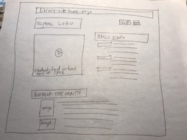

# My INF 7420 Project

I am going to build a site for my school library. The main purpose for the site will be to give more explicit information and detail in terms of what the library has to offer to all students in the school (K-12) aside from the boilerplate blurb on the school's official website.

## Wireframes

Header - will include text indicating that what follows will be basic information like hours, location in the school, technology available.

Navigation menu - each of the above mentioned details will make up the menu on this page

Main content - will include all of the basic information stated above, regarding hours, location, etc.

Footer - will include links to photos of technology, the library space

### Wireframes

Header - will indicate that this page is devoted to the Upper School

Navigation menu - options will include "research" "new releases" and "upcoming events"

Main content - will include detailed information regarding each of the above topics

Footer - will include links to research databases available to all students, link to public library, link to Newsela, Edsby

####  Wireframes

Header - will indicate that this page is devoted to the Lower School

Navigation menu - options will include "Library lessons" "new releases" and "upcoming events"

Main content - will include detailed information regarding each of the above topics

Footer - will include links to research databases available to all students, link to public library, link to Newsela, Tadpoles, Edsby
